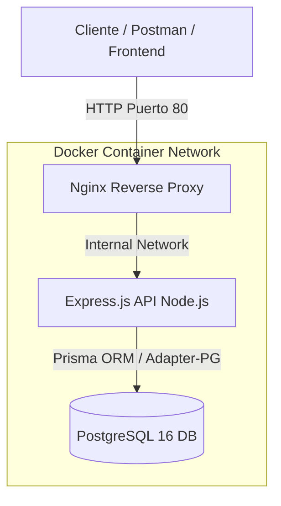

# 🏥 Medical Appointments REST API

> API RESTful robusta y escalable para la reserva y administración de citas médicas, construida con Node.js, Express.js, Prisma ORM 7 y PostgreSQL, totalmente containerizada con Docker y Nginx para entornos de producción.


---

## 📋 Tabla de Contenidos
- [Sobre el Proyecto](#-sobre-el-proyecto)
- [Arquitectura del Sistema](#-arquitectura-del-sistema)
- [Características Principales](#-características-principales)
- [Stack Tecnológico](#-stack-tecnológico)
- [Endpoints de la API](#-endpoints-de-la-api)
- [Guía de Despliegue en VPS (Ubuntu Server)](#-guía-de-despliegue-en-vps-ubuntu-server)
- [Desarrollo Local](#-desarrollo-local)
- [Estructura del Proyecto](#-estructura-del-proyecto)

---

## 💡 Sobre el Proyecto

Esta aplicación es una solución backend orientada a reserva de turnos en tiempo real. Permite gestionar usuarios, franjas horarias (TimeBlocks) y citas médicas (Appointments), garantizando la prevención de reservas duplicadas (*overbooking*) y un control estricto de accesos mediante Roles (RBAC).

El proyecto fue diseñado aplicando buenas prácticas de desarrollo backend:
- **Patrón Controller-Service-Repository** para una clara separación de responsabilidades.
- **Autenticación Stateless mediante JWT** con hash de contraseñas con `bcryptjs`.
- **Despliegue DevOps de Producción** mediante Docker Compose multinodo con proxy inverso Nginx y comprobaciones de salud (*healthchecks*).

---

## 🏗️ Arquitectura del Sistema

La arquitectura está diseñada para desacoplar el tráfico público de la aplicación backend y la base de datos mediante redes aisladas en Docker:



---

## 🚀 Características Principales

- **🔐 Autenticación & Autorización (RBAC):**
  - Registro e inicio de sesión con JWT.
  - Roles de usuario: `ADMIN` (gestión de franjas horarias y usuarios) y `USER` (reserva y consulta de turnos propios).
- **📅 Prevención de Overbooking:**
  - Validación en capa de servicio que impide la reserva duplicada de una misma franja horaria en la misma fecha.
- **🐳 Multi-stage Docker Builds:**
  - Optimización de imágenes de producción en Node Alpine ejecutadas con usuario no-root por seguridad.
- **🛡️ Nginx Reverse Proxy:**
  - Redirección de tráfico, ocultamiento del servidor Node.js y gestión centralizada de cabeceras HTTP.
- **🗄️ PostgreSQL 16 con Prisma 7:**
  - Modelado relacional con adaptador de drivers `@prisma/adapter-pg` y soporte para `prisma.config.ts`.

---

## 🛠️ Stack Tecnológico

| Tecnología | Descripción |
| :--- | :--- |
| **Node.js 20/22** | Entorno de ejecución con soporte nativo de ES Modules (ESM). |
| **Express.js v5** | Framework para el diseño de la API REST, middlewares y manejo global de errores. |
| **Prisma ORM 7** | ORM relacional moderno con `@prisma/adapter-pg`. |
| **PostgreSQL 16** | Base de datos relacional para usuarios, bloques y citas. |
| **JWT & Bcryptjs** | Seguridad, encriptación y tokens de acceso. |
| **Docker & Compose** | Containerización multi-etapa y orquestación de servicios. |
| **Nginx** | Proxy inverso para aislamiento y enrutamiento en producción. |

---

## 📌 Endpoints de la API

### 🔑 Autenticación (`/api/auth`)
- `POST /api/auth/register` - Registro de nuevos usuarios.
- `POST /api/auth/login` - Inicio de sesión y obtención de JWT.

### 👤 Usuarios (`/api/users`) - *Protegidos con JWT / Admin*
- `GET /api/users` - Lista de usuarios registrados (Solo `ADMIN`).
- `DELETE /api/users/:id` - Eliminar un usuario (Solo `ADMIN`).

### 🛠️ Administración (`/api/admin`) - *Protegidos Admin*
- `POST /api/admin/time-blocks` - Crear franjas horarias disponibles.
- `GET /api/admin/appointments` - Ver todas las citas registradas en el sistema.

### 📅 Reservas y Citas (`/api/reservations` / `/api/appointments`)
- `POST /api/reservations` - Reservar una cita (Verifica disponibilidad previamente).
- `GET /api/appointments/my-appointments` - Obtener el historial de citas del usuario autenticado.
- `DELETE /api/reservations/:id` - Cancelar una reserva existente.

---

## 🌐 Guía de Despliegue en VPS (Ubuntu Server)

Sigue estos pasos para desplegar la solución en un servidor VPS o Máquina Virtual con Ubuntu:

### 1. Requisitos Previos en el Servidor
Asegúrate de tener instalados **Git**, **Docker** y **Docker Compose**:
```bash
sudo apt update
sudo apt install -y git docker.io docker-compose-v2
sudo usermod -aG docker $USER
# Reiniciar sesión en la terminal si es necesario
```

### 2. Habilitar el Puerto en el Firewall (UFW)
```bash
sudo ufw allow 80/tcp
```

### 3. Clonar el Repositorio y Configurar `.env`
```bash
git clone https://github.com/tu-usuario/nombre-repositorio.git
cd nombre-repositorio

# Crear el archivo de entorno desde el ejemplo
cp .env.example .env
```

Edita el archivo `.env` configurando credenciales seguras para producción:
```env
POSTGRES_DB=medical_db
POSTGRES_USER=admin_user
POSTGRES_PASSWORD=super_secret_password
JWT_SECRET=super_secret_jwt_key_12345
```

### 4. Construir y Levantar los Contenedores
```bash
docker compose -f docker-compose.prod.yml up -d --build
```

### 5. Ejecutar Migraciones de la Base de Datos
```bash
docker exec -it medical_api npx prisma migrate deploy
```

¡Listo! La API estará disponible públicamente en la IP de tu servidor: `http://<TU_IP_VPS>/api/auth/login`.

---

## 💻 Desarrollo Local

Para ejecutar el proyecto en tu entorno local de desarrollo:

1. **Instalar dependencias:**
   ```bash
   npm install
   ```
2. **Levantar base de datos en Docker:**
   ```bash
   docker compose up -d
   ```
3. **Ejecutar migraciones y generar cliente de Prisma:**
   ```bash
   npx prisma migrate dev
   ```
4. **Iniciar servidor en modo desarrollo:**
   ```bash
   npm run dev
   ```

---

## 📁 Estructura del Proyecto

```text
├── src/
│   ├── config/          # Configuración de Prisma y conexiones
│   ├── controllers/     # Controladores de rutas HTTP
│   ├── middlewares/     # Auth JWT, RBAC, Logger, Error Handler
│   ├── routes/          # Definición de rutas REST por módulo
│   ├── services/        # Lógica de negocio (Prevención overbooking)
│   ├── utils/           # Utilidades y validaciones
│   ├── app.js           # Configuración de Express
│   └── server.js        # Punto de entrada de la API
├── nginx/
│   └── nginx.conf       # Configuración de Nginx Reverse Proxy
├── prisma/
│   ├── schema.prisma    # Modelado de datos
│   └── migrations/      # Historial de migraciones SQL
├── docker-compose.prod.yml # Orquestación de producción
├── Dockerfile           # Build multietapa de producción
├── prisma.config.ts     # Configuración de CLI Prisma 7
└── README.md            # Documentación del proyecto
```

